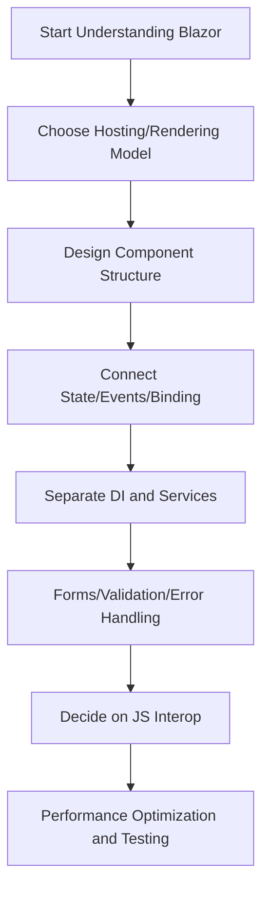
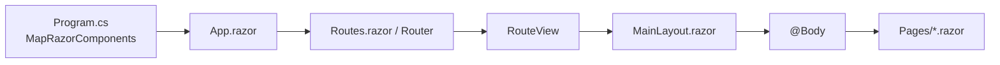

# Blazor Security Lab

[한국어](README.md) | English

A study log by a C# developer learning Blazor for the first time.
Contains code and notes recorded while studying, from basic concepts to hands-on example projects.
Later sections also include projects implementing Microsoft security topics (Entra ID / Conditional Access) in Blazor.

## Repository Structure

| Directory | Contents |
| --- | --- |
| `docs/blazor/` | Concept documents (B1~B10) |
| `Examples/` | Hands-on example projects by topic |
| `CAPolicyLab/` | Entra ID Conditional Access policy visualization project |

---

## Blazor Learning Path

The order I followed when first studying Blazor.

## Razor Rendering Flow

The basic flow for how a screen renders in a Blazor Web App.

1. `Program.cs` registers the root component via `MapRazorComponents<App>()`.
2. `Components/App.razor` renders the HTML shell and `<Routes />`.
3. The `<Router>` in `Components/Routes.razor` finds the page matching the current URL.
4. `<RouteView>` applies the default layout (e.g., `MainLayout.razor`).
5. The target page (`Pages/*.razor`) is rendered at the `@Body` position in `MainLayout.razor`.
6. In Interactive mode, event handling is activated once the connection is established after prerendering.

---

## Study Documents by Topic (B1~B10)

Documents written while studying each topic.

| Code | Topic | Document |
| --- | --- | --- |
| B1 | Blazor Basics | [docs/blazor/01-overview.md](docs/blazor/01-overview.md) |
| B2 | Hosting Models and Rendering Modes | [docs/blazor/02-hosting-render-modes.md](docs/blazor/02-hosting-render-modes.md) |
| B3 | Component Structure and Routing | [docs/blazor/03-components-routing.md](docs/blazor/03-components-routing.md) |
| B4 | State, Events, and Data Binding | [docs/blazor/04-state-events-binding.md](docs/blazor/04-state-events-binding.md) |
| B5 | Component Lifecycle | [docs/blazor/05-lifecycle.md](docs/blazor/05-lifecycle.md) |
| B6 | DI, Service Separation, State Management | [docs/blazor/06-di-services-state.md](docs/blazor/06-di-services-state.md) |
| B7 | Forms, Validation, and Error Handling | [docs/blazor/07-forms-validation-errors.md](docs/blazor/07-forms-validation-errors.md) |
| B8 | JS Interop Principles | [docs/blazor/08-js-interop.md](docs/blazor/08-js-interop.md) |
| B9 | Performance Optimization | [docs/blazor/09-performance.md](docs/blazor/09-performance.md) |
| B10 | Coding Style Guide | [docs/blazor/10-coding-style.md](docs/blazor/10-coding-style.md) |

Full list: [docs/blazor/README.md](docs/blazor/README.md)

---

## Hands-on Example Projects (Examples/)

Example projects built while practicing each topic.

- B2-Server (Interactive Server): [Examples/B2-Server/README.md](Examples/B2-Server/README.md)
- B2-WebAssembly (Standalone WASM): [Examples/B2-WebAssembly/README.md](Examples/B2-WebAssembly/README.md)
- B2-WebApp (Mixed render modes): [Examples/B2-WebApp/README.md](Examples/B2-WebApp/README.md)
- B3.ComponentsRoutingLab: [Examples/B3.ComponentsRoutingLab/README.md](Examples/B3.ComponentsRoutingLab/README.md)
- B4.StateEventsBindingLab: [Examples/B4.StateEventsBindingLab/README.md](Examples/B4.StateEventsBindingLab/README.md)
- B5.LifecycleLab: [Examples/B5.LifecycleLab/README.md](Examples/B5.LifecycleLab/README.md)
- B6.DIServiceStateLab: [Examples/B6.DIServiceStateLab/README.md](Examples/B6.DIServiceStateLab/README.md)
- B7.FormsValidationLab: [Examples/B7.FormsValidationLab/README.md](Examples/B7.FormsValidationLab/README.md)

---

## MS Security Projects

Projects built with Blazor to explore Microsoft security topics after getting comfortable with the basics.

### CAPolicyLab

A Blazor project for visualizing and studying **Microsoft Entra ID Conditional Access policies**.
The goal was to understand how the Entra ID authentication flow and CA policies work in practice.

- Project docs: [CAPolicyLab/README.md](CAPolicyLab/README.md)

---

## Microsoft Official References

- Render modes: https://learn.microsoft.com/aspnet/core/blazor/components/render-modes
- Prerender: https://learn.microsoft.com/aspnet/core/blazor/components/prerender
- Components lifecycle: https://learn.microsoft.com/aspnet/core/blazor/components/lifecycle
- Forms and validation: https://learn.microsoft.com/aspnet/core/blazor/forms/validation
- JS interop: https://learn.microsoft.com/aspnet/core/blazor/javascript-interoperability
