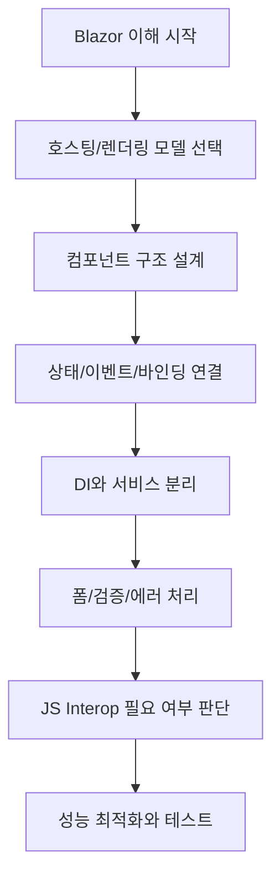
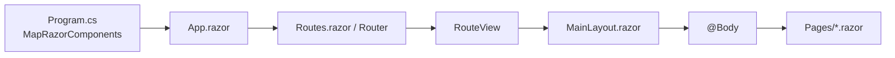

# Blazor Security Lab

이 문서는 특정 프로젝트 설명서가 아니라, Blazor를 처음 접하는 C# 개발자를 위한 공통 학습 기준서입니다.
각 프로젝트는 이 문서를 기준으로 "무엇을 어떤 방식으로 적용했는지"를 프로젝트별 README에서 매핑해 설명합니다.

## 문서 사용법

1. 먼저 이 README에서 Blazor 전체 개념을 이해합니다.
2. 다음으로 각 프로젝트의 README에서 이 개념이 어떻게 구현됐는지 확인합니다.

## Blazor 전체 흐름

## Razor 화면 렌더링 흐름 (공통)

Blazor Web App에서 화면이 렌더링될 때 기본 흐름은 아래와 같습니다.

1. `Program.cs`에서 `MapRazorComponents<App>()`로 루트 컴포넌트를 등록합니다.
2. `Components/App.razor`가 HTML 셸과 `<Routes />`를 렌더링합니다.
3. `Components/Routes.razor`의 `<Router>`가 현재 URL과 일치하는 페이지를 찾습니다.
4. `<RouteView>`가 기본 레이아웃(예: `MainLayout.razor`)을 적용합니다.
5. `MainLayout.razor`의 `@Body` 위치에 대상 페이지(`Pages/*.razor`)가 렌더링됩니다.
6. Interactive 모드일 경우 prerender 후 연결이 성립되면 이벤트 처리가 활성화됩니다.

## 학습 기준 섹션 코드

아래 코드는 프로젝트 README에서 매핑 참조용으로 사용됩니다.
각 항목을 클릭하면 기능별 상세 문서로 이동합니다.

| 코드 | 주제 | 상세 문서 |
| --- | --- | --- |
| B1 | Blazor 기본 개념 | [docs/blazor/01-overview.md](docs/blazor/01-overview.md) |
| B2 | 호스팅 모델과 렌더링 모드 | [docs/blazor/02-hosting-render-modes.md](docs/blazor/02-hosting-render-modes.md) |
| B3 | 컴포넌트 구조와 라우팅 | [docs/blazor/03-components-routing.md](docs/blazor/03-components-routing.md) |
| B4 | 상태, 이벤트, 데이터 바인딩 | [docs/blazor/04-state-events-binding.md](docs/blazor/04-state-events-binding.md) |
| B5 | 컴포넌트 생명주기 | [docs/blazor/05-lifecycle.md](docs/blazor/05-lifecycle.md) |
| B6 | DI, 서비스 분리, 상태관리 패턴 | [docs/blazor/06-di-services-state.md](docs/blazor/06-di-services-state.md) |
| B7 | 폼, 유효성 검사, 예외 처리 | [docs/blazor/07-forms-validation-errors.md](docs/blazor/07-forms-validation-errors.md) |
| B8 | JS Interop 사용 원칙 | [docs/blazor/08-js-interop.md](docs/blazor/08-js-interop.md) |
| B9 | 성능 최적화 포인트 | [docs/blazor/09-performance.md](docs/blazor/09-performance.md) |
| B10 | 코딩 스타일 가이드 | [docs/blazor/10-coding-style.md](docs/blazor/10-coding-style.md) |

## 기능별 상세 문서

루트 문서는 개념 기준서, 상세 설명은 기능별 문서에서 확인합니다.

- 상세 인덱스: [docs/blazor/README.md](docs/blazor/README.md)
- B1 상세: [docs/blazor/01-overview.md](docs/blazor/01-overview.md)
- B2 상세: [docs/blazor/02-hosting-render-modes.md](docs/blazor/02-hosting-render-modes.md)
- B3 상세: [docs/blazor/03-components-routing.md](docs/blazor/03-components-routing.md)
- B4 상세: [docs/blazor/04-state-events-binding.md](docs/blazor/04-state-events-binding.md)
- B5 상세: [docs/blazor/05-lifecycle.md](docs/blazor/05-lifecycle.md)
- B6 상세: [docs/blazor/06-di-services-state.md](docs/blazor/06-di-services-state.md)
- B7 상세: [docs/blazor/07-forms-validation-errors.md](docs/blazor/07-forms-validation-errors.md)
- B8 상세: [docs/blazor/08-js-interop.md](docs/blazor/08-js-interop.md)
- B9 상세: [docs/blazor/09-performance.md](docs/blazor/09-performance.md)
- B10 상세: [docs/blazor/10-coding-style.md](docs/blazor/10-coding-style.md)

## Microsoft 공식 문서 참고

- Render modes: https://learn.microsoft.com/aspnet/core/blazor/components/render-modes
- Prerender: https://learn.microsoft.com/aspnet/core/blazor/components/prerender
- Components lifecycle: https://learn.microsoft.com/aspnet/core/blazor/components/lifecycle
- Forms and validation: https://learn.microsoft.com/aspnet/core/blazor/forms/validation
- JS interop: https://learn.microsoft.com/aspnet/core/blazor/javascript-interoperability

## 프로젝트 적용 매핑 원칙

각 프로젝트 README는 아래 형태를 권장합니다.

1. 이 프로젝트에서 사용하는 호스팅/렌더링 모드
2. 루트 기준 섹션 코드(B1~B10) 중 어떤 항목을 적용하는지
3. 적용 근거 코드 위치(Program.cs, Pages, Services 등)
4. 학습자가 따라할 단계(구조 -> 상태 -> 서비스 -> 변경 -> 설명)

## 현재 프로젝트 매핑

### 메인 프로젝트
- CAPolicyLab: [CAPolicyLab/README.md](CAPolicyLab/README.md)

### 학습 예제 프로젝트 (Examples/)
- B2-Server (Interactive Server): [Examples/B2-Server/README.md](Examples/B2-Server/README.md)
- B2-WebAssembly (독립 WASM): [Examples/B2-WebAssembly/README.md](Examples/B2-WebAssembly/README.md)
- B2-WebApp (혼합 렌더 모드): [Examples/B2-WebApp/README.md](Examples/B2-WebApp/README.md)
- B3.ComponentsRoutingLab: [Examples/B3.ComponentsRoutingLab/README.md](Examples/B3.ComponentsRoutingLab/README.md)
- B4.StateEventsBindingLab: [Examples/B4.StateEventsBindingLab/README.md](Examples/B4.StateEventsBindingLab/README.md)
- B5.LifecycleLab: [Examples/B5.LifecycleLab/README.md](Examples/B5.LifecycleLab/README.md)
- B6.DIServiceStateLab: [Examples/B6.DIServiceStateLab/README.md](Examples/B6.DIServiceStateLab/README.md)
- B7.FormsValidationLab: [Examples/B7.FormsValidationLab/README.md](Examples/B7.FormsValidationLab/README.md)

향후 프로젝트가 추가되면 동일한 형식으로 링크를 추가합니다.
