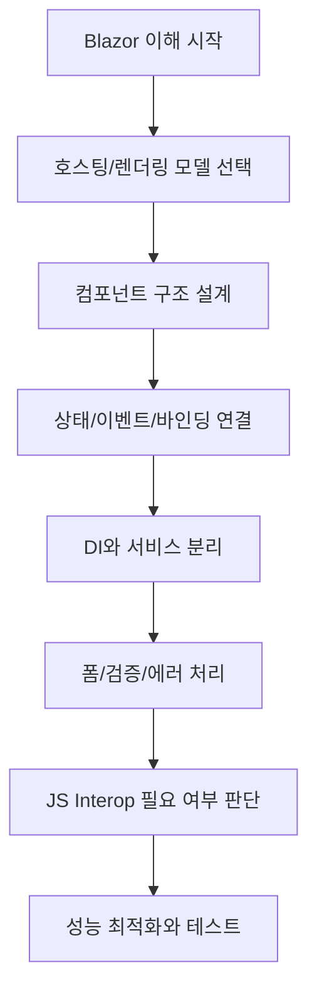
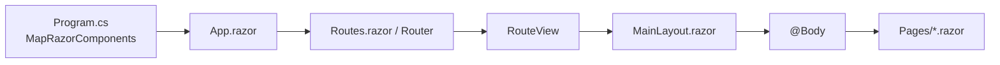

# Blazor Security Lab

[한국어](README.md) | [English](README.en.md)

C# 개발자가 Blazor를 처음 배우면서 정리한 학습 기록 저장소입니다.
기본 개념부터 실습 예제 프로젝트까지, 스터디하며 직접 만들어본 코드와 메모를 담고 있습니다.
후반부에는 MS 보안 주제를 Blazor로 구현한 프로젝트도 포함되어 있습니다.

## 이 저장소의 구성

| 구분 | 내용 |
| --- | --- |
| `docs/blazor/` | 개념 정리 문서 (B1~B10) |
| `Examples/` | 주제별 실습 예제 프로젝트 |
| `CAPolicyLab/` | Entra ID 조건부 액세스 정책 시각화 실습 프로젝트 |

---

## Blazor 학습 흐름

처음 Blazor를 접했을 때 어떤 순서로 공부했는지 정리한 흐름입니다.

## Razor 화면 렌더링 흐름

Blazor Web App에서 화면이 렌더링되는 기본 흐름입니다.

1. `Program.cs`에서 `MapRazorComponents<App>()`로 루트 컴포넌트를 등록합니다.
2. `Components/App.razor`가 HTML 셸과 `<Routes />`를 렌더링합니다.
3. `Components/Routes.razor`의 `<Router>`가 현재 URL과 일치하는 페이지를 찾습니다.
4. `<RouteView>`가 기본 레이아웃(예: `MainLayout.razor`)을 적용합니다.
5. `MainLayout.razor`의 `@Body` 위치에 대상 페이지(`Pages/*.razor`)가 렌더링됩니다.
6. Interactive 모드일 경우 prerender 후 연결이 성립되면 이벤트 처리가 활성화됩니다.

---

## 학습 주제별 문서 (B1~B10)

각 주제를 공부하면서 작성한 정리 문서입니다.

| 코드 | 주제 | 문서 |
| --- | --- | --- |
| B1 | Blazor 기본 개념 | [docs/blazor/01-overview.md](docs/blazor/01-overview.md) |
| B2 | 호스팅 모델과 렌더링 모드 | [docs/blazor/02-hosting-render-modes.md](docs/blazor/02-hosting-render-modes.md) |
| B3 | 컴포넌트 구조와 라우팅 | [docs/blazor/03-components-routing.md](docs/blazor/03-components-routing.md) |
| B4 | 상태, 이벤트, 데이터 바인딩 | [docs/blazor/04-state-events-binding.md](docs/blazor/04-state-events-binding.md) |
| B5 | 컴포넌트 생명주기 | [docs/blazor/05-lifecycle.md](docs/blazor/05-lifecycle.md) |
| B6 | DI, 서비스 분리, 상태관리 패턴 | [docs/blazor/06-di-services-state.md](docs/blazor/06-di-services-state.md) |
| B7 | 폼, 유효성 검사, 예외 처리 | [docs/blazor/07-forms-validation-errors.md](docs/blazor/07-forms-validation-errors.md) |
| B8 | JS Interop 사용 원칙 | [docs/blazor/08-js-interop.md](docs/blazor/08-js-interop.md) |
| B9 | 성능 최적화 포인트 | [docs/blazor/09-performance.md](docs/blazor/09-performance.md) |
| B10 | 코딩 스타일 가이드 | [docs/blazor/10-coding-style.md](docs/blazor/10-coding-style.md) |

전체 목록: [docs/blazor/README.md](docs/blazor/README.md)

---

## 실습 예제 프로젝트 (Examples/)

각 주제를 직접 실행해보며 만든 예제 프로젝트들입니다.

- B2-Server (Interactive Server): [Examples/B2-Server/README.md](Examples/B2-Server/README.md)
- B2-WebAssembly (독립 WASM): [Examples/B2-WebAssembly/README.md](Examples/B2-WebAssembly/README.md)
- B2-WebApp (혼합 렌더 모드): [Examples/B2-WebApp/README.md](Examples/B2-WebApp/README.md)
- B3.ComponentsRoutingLab: [Examples/B3.ComponentsRoutingLab/README.md](Examples/B3.ComponentsRoutingLab/README.md)
- B4.StateEventsBindingLab: [Examples/B4.StateEventsBindingLab/README.md](Examples/B4.StateEventsBindingLab/README.md)
- B5.LifecycleLab: [Examples/B5.LifecycleLab/README.md](Examples/B5.LifecycleLab/README.md)
- B6.DIServiceStateLab: [Examples/B6.DIServiceStateLab/README.md](Examples/B6.DIServiceStateLab/README.md)
- B7.FormsValidationLab: [Examples/B7.FormsValidationLab/README.md](Examples/B7.FormsValidationLab/README.md)

---

## MS 보안 실습 프로젝트

Blazor 기본기를 익힌 후, Microsoft 보안 주제를 Blazor로 구현해본 프로젝트입니다.

### CAPolicyLab

Microsoft Entra ID의 **조건부 액세스(Conditional Access) 정책**을 시각화하고 학습하기 위한 Blazor 프로젝트입니다.

- 프로젝트 문서: [CAPolicyLab/README.md](CAPolicyLab/README.md)

---

## 참고한 Microsoft 공식 문서

- Render modes: https://learn.microsoft.com/aspnet/core/blazor/components/render-modes
- Prerender: https://learn.microsoft.com/aspnet/core/blazor/components/prerender
- Components lifecycle: https://learn.microsoft.com/aspnet/core/blazor/components/lifecycle
- Forms and validation: https://learn.microsoft.com/aspnet/core/blazor/forms/validation
- JS interop: https://learn.microsoft.com/aspnet/core/blazor/javascript-interoperability
