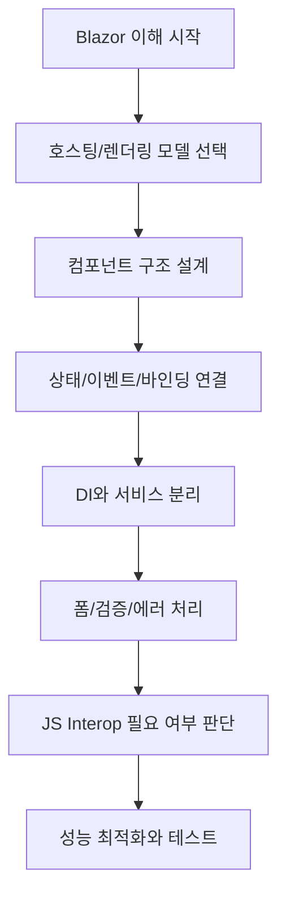

# Blazor Security Lab

이 문서는 특정 프로젝트 설명서가 아니라, Blazor를 처음 접하는 C# 개발자를 위한 공통 학습 기준서입니다.
각 프로젝트는 이 문서를 기준으로 "무엇을 어떤 방식으로 적용했는지"를 프로젝트별 README에서 매핑해 설명합니다.

## 문서 사용법

1. 먼저 이 루트 README에서 Blazor 전체 개념을 이해합니다.
2. 다음으로 각 프로젝트의 README에서 이 개념이 어떻게 구현됐는지 확인합니다.
3. 프로젝트를 추가할 때도 같은 방식으로 매핑 표를 만들면 학습 체계가 유지됩니다.

## Blazor 전체 흐름



## 학습 기준 섹션 코드

아래 코드는 프로젝트 README에서 매핑 참조용으로 사용합니다.
각 항목을 클릭하면 기능별 상세 문서로 이동합니다.

| 코드 | 주제 | 상세 문서 |
| --- | --- | --- |
| B1 | Blazor 기본 개념 | [docs/blazor/01-overview.md](docs/blazor/01-overview.md) |
| B2 | 호스팅 모델과 렌더링 모드 | [docs/blazor/02-hosting-render-modes.md](docs/blazor/02-hosting-render-modes.md) |
| B3 | 컴포넌트 구조와 라우팅 | [docs/blazor/03-components-routing.md](docs/blazor/03-components-routing.md) |
| B4 | 상태, 이벤트, 데이터 바인딩 | [docs/blazor/04-state-events-binding.md](docs/blazor/04-state-events-binding.md) |
| B5 | 컴포넌트 생명주기 | [docs/blazor/05-lifecycle.md](docs/blazor/05-lifecycle.md) |
| B6 | DI, 서비스 분리, 상태관리 패턴 | [docs/blazor/06-di-services-state.md](docs/blazor/06-di-services-state.md) |
| B7 | 폼, 유효성 검사, 예외 처리 | [docs/blazor/07-forms-validation-errors.md](docs/blazor/07-forms-validation-errors.md) |
| B8 | JS Interop 사용 원칙 | [docs/blazor/08-js-interop.md](docs/blazor/08-js-interop.md) |
| B9 | 성능 최적화 포인트 | [docs/blazor/09-performance.md](docs/blazor/09-performance.md) |
| B10 | 코딩 스타일 가이드 | [docs/blazor/10-coding-style.md](docs/blazor/10-coding-style.md) |

이 README는 각 주제의 빠른 요약을 제공하고, 상세 내용은 각 문서에서 깊게 다룹니다.

## 기능별 상세 문서

루트 문서는 개념 기준서, 상세 설명은 기능별 문서에서 확인합니다.

- 상세 인덱스: [docs/blazor/README.md](docs/blazor/README.md)
- B1 상세: [docs/blazor/01-overview.md](docs/blazor/01-overview.md)
- B2 상세: [docs/blazor/02-hosting-render-modes.md](docs/blazor/02-hosting-render-modes.md)
- B3 상세: [docs/blazor/03-components-routing.md](docs/blazor/03-components-routing.md)
- B4 상세: [docs/blazor/04-state-events-binding.md](docs/blazor/04-state-events-binding.md)
- B5 상세: [docs/blazor/05-lifecycle.md](docs/blazor/05-lifecycle.md)
- B6 상세: [docs/blazor/06-di-services-state.md](docs/blazor/06-di-services-state.md)
- B7 상세: [docs/blazor/07-forms-validation-errors.md](docs/blazor/07-forms-validation-errors.md)
- B8 상세: [docs/blazor/08-js-interop.md](docs/blazor/08-js-interop.md)
- B9 상세: [docs/blazor/09-performance.md](docs/blazor/09-performance.md)
- B10 상세: [docs/blazor/10-coding-style.md](docs/blazor/10-coding-style.md)

## B1. Blazor 기본 개념

Blazor는 C#으로 웹 UI를 작성하는 컴포넌트 기반 프레임워크입니다.

- UI 단위는 .razor 컴포넌트입니다.
- 상태가 바뀌면 컴포넌트가 다시 렌더링됩니다.
- 변경된 결과만 DOM에 반영됩니다.

핵심 사고:

- 화면을 페이지가 아닌 컴포넌트 조합으로 본다.
- 이벤트는 상태를 바꾸고, 상태는 렌더링 결과를 바꾼다.
- 비즈니스 로직은 서비스로 분리한다.

## B2. 호스팅 모델과 렌더링 모드

Microsoft 공식 문서 기준으로, Blazor Web App은 "어디서 렌더링되는가"와 "인터랙션이 가능한가"를 렌더 모드로 제어합니다.

### 호스팅 모델

1. Blazor Server
- 이벤트 처리와 UI 상호작용 로직이 서버에서 실행됩니다.
- 브라우저와 서버 간 실시간 연결(circuit)을 사용합니다.

2. Blazor WebAssembly
- 앱이 브라우저에서 실행됩니다.
- 클라이언트 측 실행/캐싱이 핵심입니다.

3. Blazor Web App(.NET 8+)
- SSR + Interactive 모드를 혼합해서 사용할 수 있습니다.
- 페이지/컴포넌트 단위로 모드를 선택할 수 있습니다.

### 렌더링 모드 요약

| 렌더 모드 | 렌더 위치 | 인터랙션 | 핵심 특징 |
| --- | --- | --- | --- |
| Static SSR | Server | No | 초기 HTML만 렌더, 이벤트 처리 없음 |
| Interactive Server | Server | Yes | 서버에서 이벤트 처리, 실시간 연결 사용 |
| Interactive WebAssembly | Client | Yes | 브라우저에서 이벤트 처리, 번들 다운로드 필요 |
| Interactive Auto | Server -> Client | Yes | 초기는 서버, 이후 방문은 클라이언트 선택 가능 |

주의:
- standalone Blazor WebAssembly 앱은 렌더 모드 개념을 별도로 사용하지 않습니다.
- 렌더 모드는 Blazor Web App에서 컴포넌트별/앱 단위 제어에 핵심입니다.

### Program.cs 설정 예시

Interactive Server만 활성화:

```csharp
builder.Services.AddRazorComponents()
    .AddInteractiveServerComponents();

app.MapRazorComponents<App>()
    .AddInteractiveServerRenderMode();
```

Interactive WebAssembly 활성화:

```csharp
builder.Services.AddRazorComponents()
    .AddInteractiveWebAssemblyComponents();

app.MapRazorComponents<App>()
    .AddInteractiveWebAssemblyRenderMode();
```

Server + WebAssembly(Interactive Auto 지원 기반) 활성화:

```csharp
builder.Services.AddRazorComponents()
    .AddInteractiveServerComponents()
    .AddInteractiveWebAssemblyComponents();

app.MapRazorComponents<App>()
    .AddInteractiveServerRenderMode()
    .AddInteractiveWebAssemblyRenderMode();
```

### @rendermode 적용 예시

컴포넌트 인스턴스에 적용:

```razor
<Dialog @rendermode="InteractiveServer" />
```

컴포넌트 정의(페이지)에서 적용:

```razor
@page "/render-mode-server"
@rendermode InteractiveServer
```

앱 전역(실질적으로 Routes, HeadOutlet) 적용 예시:

```razor
<Routes @rendermode="InteractiveServer" />
<HeadOutlet @rendermode="InteractiveServer" />
```

### Prerender 핵심 정리

- Interactive 모드는 기본적으로 prerender가 켜져 있습니다.
- prerender가 켜져 있으면 컴포넌트가 최초에 정적 렌더 후 interactive 렌더를 다시 거칠 수 있습니다.
- 필요 시 prerender를 끌 수 있습니다.

예시:

```razor
<Routes @rendermode="new InteractiveServerRenderMode(prerender: false)" />
<HeadOutlet @rendermode="new InteractiveServerRenderMode(prerender: false)" />
```

실무 팁:
- prerender 시점에는 클라이언트 전용 서비스 주입이 실패할 수 있으므로 optional 주입/추상화/서버 등록을 고려합니다.

렌더링 상태 런타임 판별 예시:

```razor
@if (!RendererInfo.IsInteractive)
{
    <p>Preparing interactive session...</p>
}
else
{
    <button @onclick="Send">Send</button>
}

@code {
    private void Send() { }
}
```

위 예시는 초기 prerender 구간과 interactive 구간을 분기해 UX를 안정화하는 기본 패턴입니다.

## B3. 컴포넌트 구조와 라우팅

- @page: 라우트 선언
- Layout: 공통 레이아웃 분리
- Pages: 화면 단위 컴포넌트
- Shared: 재사용 컴포넌트

권장 구조:

- Pages는 화면 조합과 사용자 상호작용 책임
- Shared는 반복 UI 패턴 책임
- 서비스/모델은 컴포넌트 외부에서 관리

## B4. 상태, 이벤트, 데이터 바인딩

### 이벤트 + 상태

```razor
<button @onclick="Increment">Count: @count</button>

@code {
    private int count;

    private void Increment()
    {
        count++;
    }
}
```

### 바인딩

```razor
<input @bind="name" />
<p>Hello, @name</p>

@code {
    private string name = string.Empty;
}
```

선택 기준:

- 입력 동기화가 핵심이면 @bind
- 처리 시점 제어가 필요하면 이벤트 핸들러

## B5. 컴포넌트 생명주기

주요 훅:

- OnInitialized / OnInitializedAsync: 초기 데이터 로드
- OnParametersSet / OnParametersSetAsync: 부모 파라미터 반영
- OnAfterRender / OnAfterRenderAsync: 렌더 이후 작업(JS 연동 등)

권장:

- 초기 로드는 OnInitializedAsync
- 파라미터 의존 재계산은 OnParametersSetAsync
- DOM 의존 작업은 OnAfterRenderAsync(firstRender 확인)

예시:

```razor
@code {
    protected override async Task OnInitializedAsync()
    {
        // 초기 데이터 로드
        await Task.CompletedTask;
    }

    protected override async Task OnAfterRenderAsync(bool firstRender)
    {
        if (firstRender)
        {
            // 첫 렌더 이후 한 번만 실행
            await Task.CompletedTask;
        }
    }
}
```

## B6. DI, 서비스 분리, 상태관리 패턴

- @inject 또는 생성자 주입으로 서비스 사용
- 컴포넌트는 UI 중심, 서비스는 도메인/IO 중심
- 상태 공유는 필요한 범위에서만 사용

기본 패턴:

- 로컬 상태: 컴포넌트 private 필드
- 페이지 공유 상태: scoped 상태 서비스
- 앱 전역 설정: singleton(주의해서 사용)

## B7. 폼, 유효성 검사, 예외 처리

- EditForm + DataAnnotationsValidator 조합 사용
- ValidationSummary/ValidationMessage로 오류 표시
- 사용자 액션 경계에서 예외를 잡고 UI에 의미 있는 메시지 노출

예시:

```razor
<EditForm Model="model" OnValidSubmit="Save">
    <DataAnnotationsValidator />
    <ValidationSummary />

    <InputText @bind-Value="model.Name" />
    <button type="submit">Save</button>
</EditForm>

@code {
    private DemoModel model = new();

    private Task Save() => Task.CompletedTask;

    public class DemoModel
    {
        [System.ComponentModel.DataAnnotations.Required]
        public string Name { get; set; } = string.Empty;
    }
}
```

## B8. JS Interop 사용 원칙

JS Interop는 아래 경우에만 우선 고려합니다.

- 브라우저 전용 API 접근이 필요한 경우
- 차트/에디터 같은 JS 라이브러리 연동이 필요한 경우
- Blazor 기본 기능으로 대체가 어려운 경우

원칙:

- 인터롭 호출 지점을 컴포넌트에 흩뿌리지 않기
- 가능한 얇은 래퍼 서비스로 추상화

예시:

```razor
@inject IJSRuntime JS

<button @onclick="ShowAlert">Alert</button>

@code {
    private async Task ShowAlert()
    {
        await JS.InvokeVoidAsync("alert", "Hello from Blazor");
    }
}
```

## B9. 성능 최적화 포인트

- 불필요한 렌더링 줄이기
- 큰 리스트는 가상화 고려
- 비동기 IO는 적절히 분할
- 렌더링 병목은 먼저 계측 후 최적화

## B10. 코딩 스타일 가이드

- 컴포넌트는 짧고 읽기 쉽게 유지
- UI 로직과 도메인 로직 분리
- 이름은 의도 중심으로 명확히 작성
- 이벤트 핸들러는 "무엇을 바꾸는지"가 보이게 작성
- 상태 변경 포인트는 한눈에 찾을 수 있게 배치

## Microsoft 공식 문서 참고

- Render modes: https://learn.microsoft.com/aspnet/core/blazor/components/render-modes
- Prerender: https://learn.microsoft.com/aspnet/core/blazor/components/prerender
- Components lifecycle: https://learn.microsoft.com/aspnet/core/blazor/components/lifecycle
- Forms and validation: https://learn.microsoft.com/aspnet/core/blazor/forms/validation
- JS interop: https://learn.microsoft.com/aspnet/core/blazor/javascript-interoperability

## 프로젝트 적용 매핑 원칙

각 프로젝트 README는 아래 형태를 권장합니다.

1. 이 프로젝트에서 사용하는 호스팅/렌더링 모드
2. 루트 기준 섹션 코드(B1~B10) 중 어떤 항목을 적용하는지
3. 적용 근거 코드 위치(Program.cs, Pages, Services 등)
4. 학습자가 따라할 단계(구조 -> 상태 -> 서비스 -> 변경 -> 설명)

## 현재 프로젝트 매핑

- CAPolicyLab: [CAPolicyLab/README.md](CAPolicyLab/README.md)

향후 프로젝트가 추가되면 동일한 형식으로 링크를 추가합니다.
